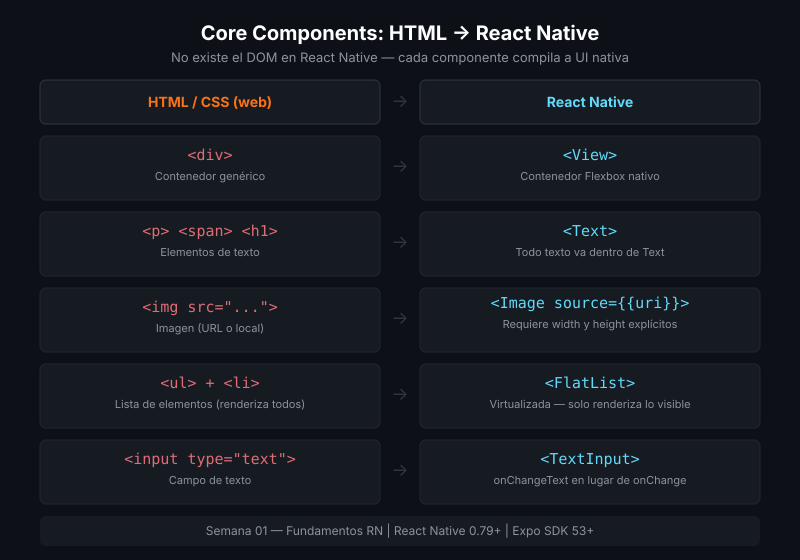

# Core Components de React Native

## 🎯 Objetivos

- Conocer y usar los componentes fundamentales de React Native
- Entender cuándo usar cada componente y sus propiedades esenciales
- Crear estilos con `StyleSheet.create` y entender por qué no se usa CSS

---



---

## 1. View — el contenedor universal

`View` es el equivalente al `<div>` de la web. Sirve para agrupar elementos, aplicar estilos y construir layouts con Flexbox.

```tsx
import { View, StyleSheet } from 'react-native';

// View simple con estilo
<View style={styles.card}>
  {/* Aquí van los elementos hijos */}
</View>

const styles = StyleSheet.create({
  card: {
    backgroundColor: '#161b22',
    borderRadius: 12,
    padding: 16,
    marginBottom: 12,
  },
});
```

> **Importante**: `View` no tiene scroll por defecto. Si el contenido puede crecer, usa `ScrollView`.

---

## 2. Text — todo texto va aquí

A diferencia de la web, **en React Native todo texto debe estar en un componente `<Text>`**. No existen `<p>`, `<h1>`, `<span>`.

```tsx
import { Text, StyleSheet } from 'react-native';

<Text style={styles.title}>Título de la app</Text>
<Text style={styles.body}>
  El texto puede tener múltiples líneas. Se puede anidar{' '}
  <Text style={styles.bold}>texto con estilos diferentes</Text>{' '}
  dentro del mismo párrafo.
</Text>

const styles = StyleSheet.create({
  title: { fontSize: 24, fontWeight: 'bold', color: '#ffffff' },
  body: { fontSize: 16, color: '#8b949e', lineHeight: 24 },
  bold: { fontWeight: 'bold', color: '#61DAFB' },
});
```

### Propiedades útiles de Text

| Propiedad | Tipo | Descripción |
| --------- | ---- | ----------- |
| `numberOfLines` | number | Trunca el texto después de N líneas |
| `ellipsizeMode` | `'tail'` \| `'head'` \| `'middle'` | Dónde aparece `...` al truncar |
| `selectable` | boolean | Permite seleccionar el texto |
| `onPress` | function | Texto tappeable (pero prefiere `Pressable`) |

---

## 3. Image — imágenes locales y remotas

```tsx
import { Image, StyleSheet } from 'react-native';

// Imagen local (require retorna el módulo de la imagen)
<Image
  source={require('../assets/logo.png')}
  style={styles.logo}
/>

// Imagen remota (siempre requiere width y height)
<Image
  source={{ uri: 'https://picsum.photos/200/200' }}
  style={styles.avatar}
  resizeMode="cover"
/>

const styles = StyleSheet.create({
  logo: { width: 120, height: 120 },
  avatar: { width: 48, height: 48, borderRadius: 24 },
});
```

> **Nota de rendimiento**: Para imágenes en listas y con caché avanzado, usa `expo-image` (semana 14). Por ahora `Image` de React Native es suficiente.

### `resizeMode` — cómo ajusta la imagen

| Valor | Comportamiento |
| ----- | -------------- |
| `'cover'` | Cubre el contenedor, puede recortar (como `object-fit: cover`) |
| `'contain'` | Cabe completa dentro del contenedor, puede dejar espacio vacío |
| `'stretch'` | Estira para llenar exactamente (puede distorsionar) |
| `'center'` | Tamaño original, centrada |

---

## 4. ScrollView — contenido desplazable

Cuando el contenido puede superar el alto de la pantalla:

```tsx
import { ScrollView, View, Text, StyleSheet } from 'react-native';

<ScrollView
  style={styles.scroll}
  showsVerticalScrollIndicator={false}   // Oculta el scrollbar
  keyboardShouldPersistTaps="handled"    // El teclado se oculta al tocar fuera de inputs
>
  {/* Contenido largo aquí */}
  <View style={styles.seccion}>
    <Text>Sección 1</Text>
  </View>
  <View style={styles.seccion}>
    <Text>Sección 2</Text>
  </View>
</ScrollView>
```

> **Advertencia**: `ScrollView` renderiza **todos los hijos a la vez**. Si tienes una lista de cientos de elementos, usa `FlatList` (semana 02).

---

## 5. Pressable y TouchableOpacity — elementos tapeables

Para responder a toques, React Native tiene varias opciones. Las más usadas:

### Pressable (recomendado — moderno)

```tsx
import { Pressable, Text, StyleSheet } from 'react-native';

<Pressable
  style={({ pressed }) => [
    styles.button,
    pressed && styles.buttonPressed,  // Estilo cuando se presiona
  ]}
  onPress={() => console.log('presionado')}
  onLongPress={() => console.log('presión larga')}
>
  <Text style={styles.buttonText}>Presióname</Text>
</Pressable>

const styles = StyleSheet.create({
  button: { backgroundColor: '#61DAFB', padding: 12, borderRadius: 8 },
  buttonPressed: { opacity: 0.7 },
  buttonText: { color: '#0d1117', fontWeight: 'bold', textAlign: 'center' },
});
```

### TouchableOpacity (clásico)

```tsx
import { TouchableOpacity, Text } from 'react-native';

<TouchableOpacity
  activeOpacity={0.7}    // Reduce opacidad al 70% al presionar
  onPress={() => console.log('tap')}
>
  <Text>Botón clásico</Text>
</TouchableOpacity>
```

**¿Cuál usar?** `Pressable` es más flexible y es el enfoque moderno. `TouchableOpacity` todavía es muy común en código existente.

---

## 6. StyleSheet — estilos en React Native

React Native no usa CSS. En su lugar usa `StyleSheet`, que valida los estilos en tiempo de desarrollo y optimiza el rendimiento.

```tsx
import { StyleSheet } from 'react-native';

const styles = StyleSheet.create({
  container: {
    flex: 1,
    backgroundColor: '#0d1117',
    padding: 16,
  },
  title: {
    fontSize: 20,
    fontWeight: 'bold',
    color: '#ffffff',
    marginBottom: 8,
  },
});

// Combinar estilos
<View style={[styles.container, { borderWidth: 1 }]} />
```

### Diferencias importantes con CSS

| CSS | React Native |
| --- | ------------ |
| `font-size: 16px` | `fontSize: 16` (número, sin unidad) |
| `background-color: red` | `backgroundColor: 'red'` (camelCase) |
| `border-radius: 8px` | `borderRadius: 8` |
| Herencia de estilos | Sin herencia — cada componente es independiente |
| Clases reutilizadas | Objetos JavaScript compartidos por referencia |

---

## 📚 Recursos adicionales

- [React Native — Core Components](https://reactnative.dev/docs/components-and-apis)
- [React Native — StyleSheet](https://reactnative.dev/docs/stylesheet)
- [Expo — Image](https://docs.expo.dev/versions/latest/sdk/image/)

## ✅ Checklist

- [ ] Creé un componente con `View`, `Text` e `Image`
- [ ] Usé `ScrollView` para una lista de elementos
- [ ] Implementé un botón con `Pressable` y cambio de estilo al presionar
- [ ] Definí todos los estilos con `StyleSheet.create`
