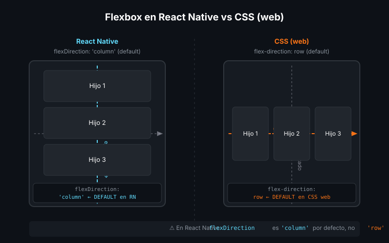

# Flexbox en React Native

## 🎯 Objetivos

- Dominar el modelo de layout Flexbox para posicionar elementos en pantalla
- Entender las diferencias entre Flexbox en CSS y en React Native
- Construir layouts reales de apps móviles

---

## 1. Flexbox: el sistema de layout de RN

React Native usa **Flexbox** como único sistema de layout (no existe CSS Grid ni float). Todas las `View` son flex containers por defecto.



### La diferencia más importante con el web

En CSS el eje principal es **horizontal** por defecto (`flex-direction: row`).
En React Native el eje principal es **vertical** por defecto (`flexDirection: 'column'`).

```tsx
// En React Native, los hijos se apilan VERTICALMENTE por defecto
<View>
  <Text>Elemento 1</Text>   {/* ↓ */}
  <Text>Elemento 2</Text>   {/* ↓ */}
  <Text>Elemento 3</Text>   {/* ↓ */}
</View>
```

---

## 2. `flexDirection` — dirección del eje principal

```tsx
// column (default) — vertical, de arriba a abajo
<View style={{ flexDirection: 'column' }}>
  <View style={styles.caja} />  {/* ↓ */}
  <View style={styles.caja} />  {/* ↓ */}
</View>

// row — horizontal, de izquierda a derecha
<View style={{ flexDirection: 'row' }}>
  <View style={styles.caja} />  {/* → */}
  <View style={styles.caja} />  {/* → */}
</View>

// column-reverse / row-reverse — dirección invertida
```

---

## 3. `justifyContent` — distribución en el eje principal

Controla cómo se distribuyen los hijos **en la dirección del eje principal**.

```tsx
// flex-start (default): agrupa al inicio
// center: centra en el eje
// flex-end: agrupa al final
// space-between: espacio igual ENTRE los hijos
// space-around: espacio igual ALREDEDOR de cada hijo
// space-evenly: espacio igual incluyendo los extremos

<View style={{ flex: 1, justifyContent: 'space-between' }}>
  <Text>Arriba</Text>
  <Text>Centro</Text>
  <Text>Abajo</Text>
</View>
```

---

## 4. `alignItems` — alineación en el eje cruzado

Controla cómo se posicionan los hijos **en el eje perpendicular** al principal.

```tsx
// stretch (default): los hijos se estiran para llenar el contenedor
// flex-start: alineados al inicio del eje cruzado
// center: centrados en el eje cruzado
// flex-end: alineados al final del eje cruzado

<View style={{ flexDirection: 'row', alignItems: 'center' }}>
  <Image style={{ width: 48, height: 48 }} source={...} />
  <Text>Alineado verticalmente al centro del avatar</Text>
</View>
```

---

## 5. `flex` — cómo crecer en el espacio disponible

`flex: N` indica qué proporción del espacio disponible ocupa un hijo.

```tsx
<View style={{ flex: 1, flexDirection: 'row' }}>
  {/* Ocupa 1/3 del ancho */}
  <View style={{ flex: 1, backgroundColor: '#161b22' }} />
  {/* Ocupa 2/3 del ancho */}
  <View style={{ flex: 2, backgroundColor: '#30363d' }} />
</View>
```

`flex: 1` en la `View` raíz es el patrón más habitual: la pantalla llena 100% del espacio disponible.

---

## 6. Layouts reales de apps móviles

### Layout de tarjeta con imagen y texto

```tsx
// Patrón: imagen a la izquierda, texto a la derecha
<View style={styles.card}>
  <Image style={styles.avatar} source={{ uri: '...' }} resizeMode="cover" />
  <View style={styles.info}>
    <Text style={styles.name}>Ada Lovelace</Text>
    <Text style={styles.subtitle}>Ingeniera de Software</Text>
  </View>
</View>

const styles = StyleSheet.create({
  card: {
    flexDirection: 'row',   // Imagen y texto en fila
    alignItems: 'center',   // Centrados verticalmente
    padding: 16,
    gap: 12,                // Espacio entre imagen y texto (RN 0.71+)
  },
  avatar: { width: 56, height: 56, borderRadius: 28 },
  info: { flex: 1 },        // El bloque de texto ocupa el espacio restante
  name: { fontSize: 16, fontWeight: 'bold', color: '#fff' },
  subtitle: { fontSize: 14, color: '#8b949e' },
});
```

### Layout de header con título y botón

```tsx
// Patrón: título a la izquierda, botón a la derecha
<View style={styles.header}>
  <Text style={styles.headerTitle}>Inicio</Text>
  <Pressable onPress={handleAdd}>
    <Text style={styles.btnAdd}>+ Nuevo</Text>
  </Pressable>
</View>

const styles = StyleSheet.create({
  header: {
    flexDirection: 'row',
    justifyContent: 'space-between',
    alignItems: 'center',
    paddingHorizontal: 16,
    paddingVertical: 12,
  },
  headerTitle: { fontSize: 22, fontWeight: 'bold', color: '#fff' },
  btnAdd: { fontSize: 14, color: '#61DAFB' },
});
```

---

## 7. `gap`, `padding`, `margin` y el box model

```tsx
const styles = StyleSheet.create({
  container: {
    padding: 16,            // padding en todos los lados
    paddingHorizontal: 24,  // solo izquierda y derecha
    paddingVertical: 12,    // solo arriba y abajo
    marginBottom: 8,        // margen solo abajo
    gap: 12,                // espacio entre hijos flex (RN 0.71+)
  },
});
```

> **`gap`** es una adición reciente (RN 0.71+, disponible en Expo SDK 50+). Antes se usaba `marginBottom` o `marginRight` en los hijos. En este bootcamp usamos `gap` siempre que sea posible.

---

## 8. Depurar layouts con bordes de color

Un truco muy útil al construir layouts: añadir `borderWidth` y `borderColor` a las `View` para ver sus dimensiones:

```tsx
// Activar temporalmente para depurar
<View style={[styles.container, { borderWidth: 1, borderColor: 'red' }]}>
  <View style={[styles.hijo, { borderWidth: 1, borderColor: 'blue' }]} />
</View>
```

---

## 📚 Recursos adicionales

- [React Native — Layout with Flexbox](https://reactnative.dev/docs/flexbox)
- [Yoga Playground (motor de layout de RN)](https://yogalayout.dev/playground)
- [Flexbox Froggy — juego para practicar Flexbox](https://flexboxfroggy.com/)

## ✅ Checklist

- [ ] Entiendo por qué `flexDirection` por defecto es `'column'` en RN (no `'row'`)
- [ ] Construí un layout de tarjeta con imagen y texto usando `flexDirection: 'row'`
- [ ] Usé `justifyContent: 'space-between'` para separar elementos en un header
- [ ] Usé `flex: 1` para que una vista ocupe el espacio disponible
